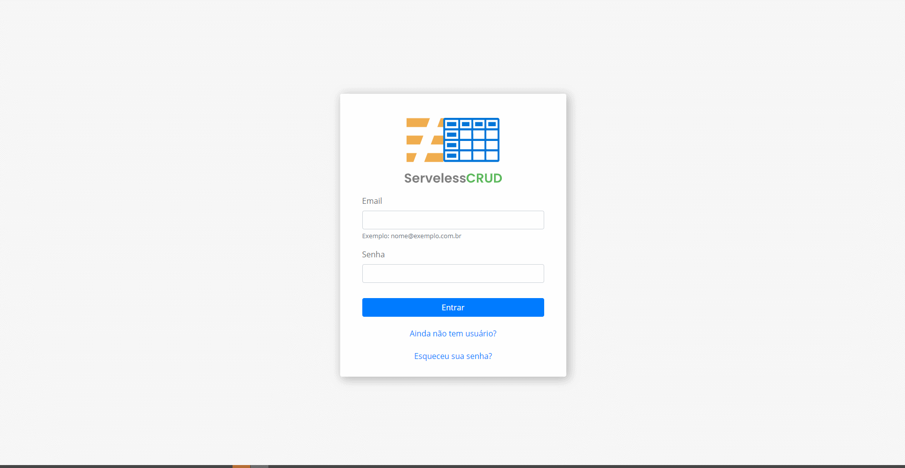

<h1 align="center">
    ServelessCRUD
<h1>

<h1 align="center">ReactJS || Firebase
    
  
        
        
    

</h1>

  <a href="#❓-sobre">Sobre</a>&nbsp;&nbsp;&nbsp;|&nbsp;&nbsp;&nbsp;
   <a href="#🚧-implementação">Implementação</a>&nbsp;&nbsp;&nbsp;|&nbsp;&nbsp;&nbsp;
  <a href="#💻-tecnologias">Tecnologias</a>&nbsp;&nbsp;&nbsp;|&nbsp;&nbsp;&nbsp;
  <a href="#🔥-como-executar">Como Executar</a>&nbsp;&nbsp;&nbsp;

    <a align="center" href="https://serveless-crud.web.app/">https://serveless-crud.web.app/<a>

 

## ❓ Sobre
 

### O **servelessCRUD** é uma aplicação feita para gravar dados de pessoas. 
 

## 🚧 Implementação
 

#### Para criação da aplicação foi desenvolvido um layout simples e objetivo com poucas funcionalidades, trazendo somente o necessário para o uso.
#### Foi escolhido o Bootstrap e o Styled Components para desenvolvimento da UI devido a agilidade e facilidade que essas ferramentas trazem.  
 

#### Para desenvolvimento da parte de armazenamento e manipulação de dados foi escolhido o Firebase. A escolha sobre o firebase foi feita por conta das funções pré definidas que a ferramenta traz. O processo de autenticação é feito de uma forma bem simples e caso seja necessário novas implementações o Firebase traz muitas outras ferramentas que podem agregar, como: as Lambdas e o RealTimeDatabase.
#### Visando a praticidade, o banco de dados foi feito em SQLite e já populado com alguns dados por padrão.
 

 

## 💻 Tecnologias 
-  [Typescript](https://www.typescriptlang.org/)
-  [ReactJS](https://reactjs.org/)
-  [ReactBootstrap](https://react-bootstrap.github.io/)
-  [Firebase](https://firebase.google.com/)

 

 

## 🔥 Como Executar 
 

- ### **Pré-requisitos**

  - É **necessário** possuir o **[Node.js](https://nodejs.org/en/)** instalado no computador
  - É **necessário** possuir o **[Git](https://git-scm.com/)** instalado e configurado no computador
  - Também, é **preciso** ter um gerenciador de pacotes seja o **[NPM](https://www.npmjs.com/)** ou **[Yarn](https://yarnpkg.com/)**.

 

#### Para configurar o projeto, crie um arquivo .env na raiz do seu diretório e insira as seguintes variáveis de ambiente.

 

| CHAVE   |      VALOR      |
|----------|:-------------:|
| REACT_APP_FIREBASE_KEY | apiKey |
| REACT_APP_FIREBASE_AUTH_DOMAIN | authDomain |
| REACT_APP_PROJECT_ID | projectId |
| REACT_APP_STORAGE_BUCKET | storageBucket |
| REACT_APP_MESSAGING_SENDER_ID | messagingSenderId |
| REACT_APP_APP_ID | appId |

 

#### Para executar o servidor da aplicação, abra o terminal do seu sistema operacional, navegue até a pasta do projeto, entre no diretório server e execute:

 

    npm install

 

#### Esse comando fará com que o node instale todas as dependências de seu projeto.

 

#### Para rodar o servidor digite:

 

    npm start

 

Pronto!!! Agora seu sistema estará rodando na porta 3000 do seu computador.